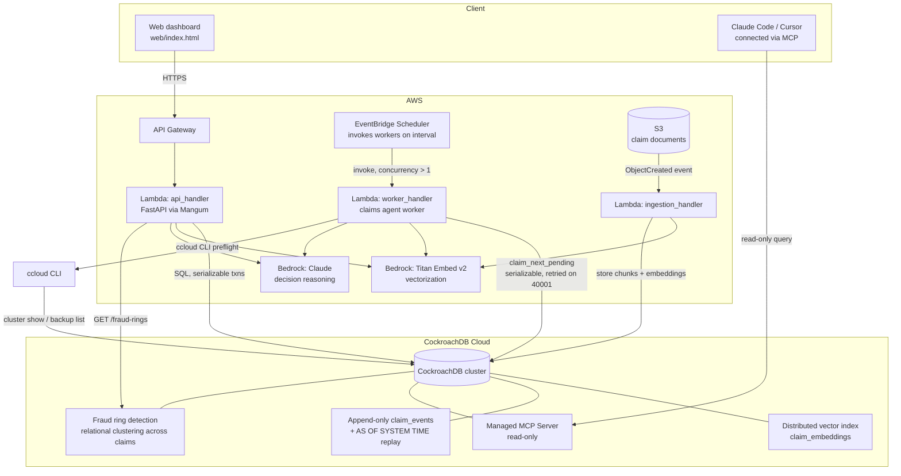

# Architecture



## Why each piece exists

- **API (Lambda + API Gateway, FastAPI/Mangum)** — same code runs locally
  (`uvicorn`) and in Lambda; no fork between dev and prod.
- **Worker Lambda + EventBridge Scheduler** — deliberately invoked with
  concurrency, so multiple independent "agents" race for the same pool of
  pending claims. This is the setup that makes CockroachDB's serializable
  isolation load-bearing rather than decorative — see
  `src/verity/claims_engine.py::claim_next_pending` and the retry loop in
  `src/verity/db.py::run_in_transaction`.
- **Distributed vector index** (`claim_embeddings`, `CREATE VECTOR INDEX`) —
  semantic recall over claim descriptions and ingested documents, used for
  fraud-pattern / precedent matching, living in the same transactionally
  consistent store as the relational claim data (no separate vector DB to
  keep in sync).
- **Append-only `claim_events` + `AS OF SYSTEM TIME`** — every decision
  stores the exact HLC read timestamp it used
  (`decisions.context_hlc_time`). `src/verity/audit.py::replay_decision`
  re-runs the original queries `AS OF SYSTEM TIME` that value to reconstruct
  precisely what the agent knew, even after the underlying data has since
  changed. This is the compliance/audit story.
- **Managed MCP Server** — lets a human (compliance reviewer, or you, live
  in the demo video) connect Claude Code/Cursor directly to the cluster in
  read-only mode and query the agent's actual memory, independent of the
  application — proof the memory layer isn't a black box.
- **ccloud CLI** — used both for cluster provisioning (`ops/ccloud/provision_cluster.sh`)
  and as a narrow, read-only preflight check
  (`src/verity/cluster_ops.py::preflight_health_check`) the ingestion
  pipeline calls before a bulk document batch, so the pipeline fails fast
  and clearly instead of hammering a degraded cluster.
- **S3** — durable store for raw claim attachments; the ingestion Lambda
  parses and embeds them into the same memory store the claims agent reads
  from.
- **Fraud ring detection** (`src/verity/fraud_ring.py`) — a relational
  `GROUP BY ... HAVING count(*) > 1` over the same store, clustering claims
  that share a bank account or address across different claimant names. See
  [Fraud Ring Buster](#fraud-ring-buster-memory-across-claims-not-within-one)
  below for why this is a distinct kind of memory from everything above it.

## Data model

See [`db/schema.sql`](db/schema.sql) for the full DDL. Five tables carry the
memory:

| Table | Role |
|---|---|
| `claims` | current transactional state of each case |
| `claim_events` | append-only log; source of truth for time-travel replay |
| `claim_embeddings` | distributed vector index; semantic memory |
| `decisions` | every agent decision + the exact context/timestamp it used |
| `documents` | S3 pointers + extracted text for ingested attachments |

`claims.bank_account_last4` and `claims.claimant_address` are the two
optional columns `fraud_ring.py` clusters on (see below). Neither is ever
read by the agent's own decision logic (`claims_engine.py::_gather_context`)
- feeding identity attributes into the model's reasoning would be a real
bias risk. They exist solely as a second, independent memory surface a
human reviewer can query across every claim on file.

## Fraud Ring Buster: memory across claims, not within one

Every other feature in this system answers "what did the agent know about
*this* claim." Fraud Ring Buster (`src/verity/fraud_ring.py`, `GET
/fraud-rings`, `web-app/src/pages/FraudRing.tsx`) answers a different
question: what's true *across* claims that no single claim reveals.

Three claims filed under three different names, weeks apart, each for an
unremarkable amount, are individually invisible to any per-claim review -
automated or human. What connects them (the same bank account routing to
all three, or the same claimant address) only exists in the relationship
between rows, which requires a query that spans the whole table:

```sql
SELECT bank_account_last4, array_agg(id), array_agg(claimant_name), ...
FROM claims
WHERE bank_account_last4 IS NOT NULL
GROUP BY bank_account_last4
HAVING count(*) > 1
```

This is the same argument the concurrency and replay features make, applied
to a different axis: a stateless agent evaluating claims one at a time,
however good its reasoning, cannot see this pattern by construction - there
is no "this claim" whose context includes it. Only a persistent store that
can be queried across every claim ever filed can. The frontend renders each
detected ring as a force-directed graph (`d3-force`, plain SVG) so a
reviewer can see the cluster form and click straight into any claim in it,
rather than reading a flat list of IDs.

The relational clustering here is deliberately simple (exact-match
`GROUP BY`, no fuzzy matching) and is a second, independent signal alongside
the semantic similarity `vector_memory.find_similar_claims` already
provides - the two aren't merged into one combined query, since exact
identity matches and semantic description similarity are different claims
about the data and conflating them would make either one harder to trust.

## Multi-region design (documented, not deployed)

The cluster this project actually runs on is CockroachDB **Serverless/Basic**
tier, single-region (`us-east-1`) — confirmed via `ccloud cluster info`.
Basic tier has no node/topology control (it auto-scales within one region;
see the `managing-cluster-capacity` skill), so `ADD REGION` and
`SURVIVE REGION FAILURE` are unavailable without upgrading to a **Standard**
or **Advanced** cluster, which is provisioned and billed continuously. That
upgrade wasn't made for this hackathon build — real recurring cost and
migration risk to a working deployment days before the deadline aren't worth
it just to demo a settings change. The design below is the real production
path, sized to this schema, not a generic multi-region tutorial.

**Why `organizations` is the right partition key.** Every claims-related
table (`claims`, `policies`, `documents`, `claim_embeddings`, `decisions`,
`reviews`, `payouts`) traces back to `org_id`. Each insurance carrier using
Verity operates out of one home region in practice — this is naturally
tenant-partitioned data, not data that needs a single row edited
simultaneously from two continents. That rules out `GLOBAL` tables (built for
reference data read everywhere, not tenant-owned operational state) and makes
manual geo-partitioning more operational overhead than the workload justifies.
`REGIONAL BY ROW` is the fit: CockroachDB keeps each carrier's data — and its
leaseholder — local to that carrier's region automatically.

**The migration, concretely:**

```sql
ALTER DATABASE verity PRIMARY REGION 'us-east-1';
ALTER DATABASE verity ADD REGION 'eu-west-1';
ALTER DATABASE verity ADD REGION 'ap-southeast-1';
ALTER DATABASE verity SURVIVE REGION FAILURE;

ALTER TABLE organizations ADD COLUMN home_region crdb_internal_region
    NOT NULL DEFAULT gateway_region()::crdb_internal_region;
```

`claims`, `policies`, `documents`, `claim_embeddings`, `decisions`, and
`reviews` each get a `region` column stamped from their owning org's
`home_region` at insert time (application-level, in `claims_engine.py`) and
become `LOCALITY REGIONAL BY ROW AS region`. Denormalizing the region onto
every table in a claim's chain — not just `claims` itself — matters here
specifically because `_gather_context()` (`claims_engine.py`) reads across
`claims`, `policies`, `claim_events`, and `claim_embeddings` in one pass
before the model call; if those leaseholders weren't co-located, the read
that grounds every decision would pay cross-region latency (50-150ms+ per
the `designing-multi-region-applications` skill) on the one path where speed
matters most.

**What this actually buys, honestly.** `REGIONAL BY ROW` does not make every
write fast from every region — a US carrier's claims are still homed in
`us-east-1`. What it buys is two things: each carrier gets local latency in
its own region (a EU carrier's claims would be just as fast in `eu-west-1`
as this demo is in `us-east-1` today), and `SURVIVE REGION FAILURE` means an
entire AWS region going dark loses zero committed claims data for anyone —
which is the actual guarantee this hackathon's "always-on, no data loss"
framing is about, not a marketing claim.

**The AWS half of this.** The Lambda functions would deploy per-region (one
SAM stack per region, matching the CockroachDB regions above) so each
region's API and worker talk to their local leaseholder instead of hopping
across the network for every query — Route 53 latency-based routing in front
of regional API Gateway endpoints gets a request to its nearest Lambda, which
gets a query to its nearest leaseholder, end to end.
