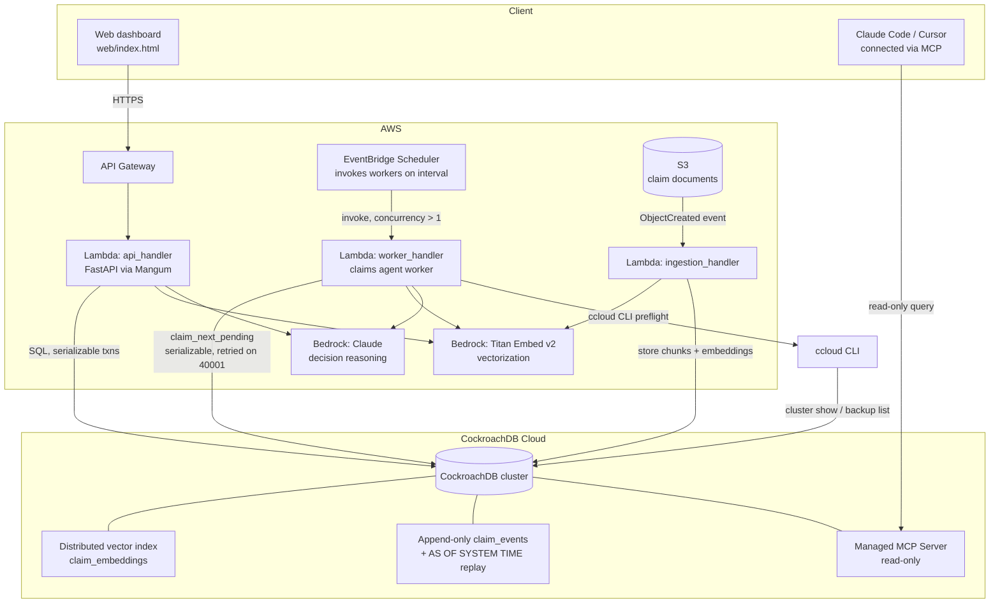

# Architecture

## Why each piece exists

- **API (Lambda + API Gateway, FastAPI/Mangum)** — same code runs locally
  (`uvicorn`) and in Lambda; no fork between dev and prod.
- **Worker Lambda + EventBridge Scheduler** — deliberately invoked with
  concurrency, so multiple independent "agents" race for the same pool of
  pending claims. This is the setup that makes CockroachDB's serializable
  isolation load-bearing rather than decorative — see
  `src/verity/claims_engine.py::claim_next_pending` and the retry loop in
  `src/verity/db.py::run_in_transaction`.
- **Distributed vector index** (`claim_embeddings`, `CREATE VECTOR INDEX`) —
  semantic recall over claim descriptions and ingested documents, used for
  fraud-pattern / precedent matching, living in the same transactionally
  consistent store as the relational claim data (no separate vector DB to
  keep in sync).
- **Append-only `claim_events` + `AS OF SYSTEM TIME`** — every decision
  stores the exact HLC read timestamp it used
  (`decisions.context_hlc_time`). `src/verity/audit.py::replay_decision`
  re-runs the original queries `AS OF SYSTEM TIME` that value to reconstruct
  precisely what the agent knew, even after the underlying data has since
  changed. This is the compliance/audit story.
- **Managed MCP Server** — lets a human (compliance reviewer, or you, live
  in the demo video) connect Claude Code/Cursor directly to the cluster in
  read-only mode and query the agent's actual memory, independent of the
  application — proof the memory layer isn't a black box.
- **ccloud CLI** — used both for cluster provisioning (`ops/ccloud/provision_cluster.sh`)
  and as a narrow, read-only preflight check
  (`src/verity/cluster_ops.py::preflight_health_check`) the ingestion
  pipeline calls before a bulk document batch, so the pipeline fails fast
  and clearly instead of hammering a degraded cluster.
- **S3** — durable store for raw claim attachments; the ingestion Lambda
  parses and embeds them into the same memory store the claims agent reads
  from.

## Data model

See [`db/schema.sql`](db/schema.sql) for the full DDL. Five tables carry the
memory:

| Table | Role |
|---|---|
| `claims` | current transactional state of each case |
| `claim_events` | append-only log; source of truth for time-travel replay |
| `claim_embeddings` | distributed vector index; semantic memory |
| `decisions` | every agent decision + the exact context/timestamp it used |
| `documents` | S3 pointers + extracted text for ingested attachments |
